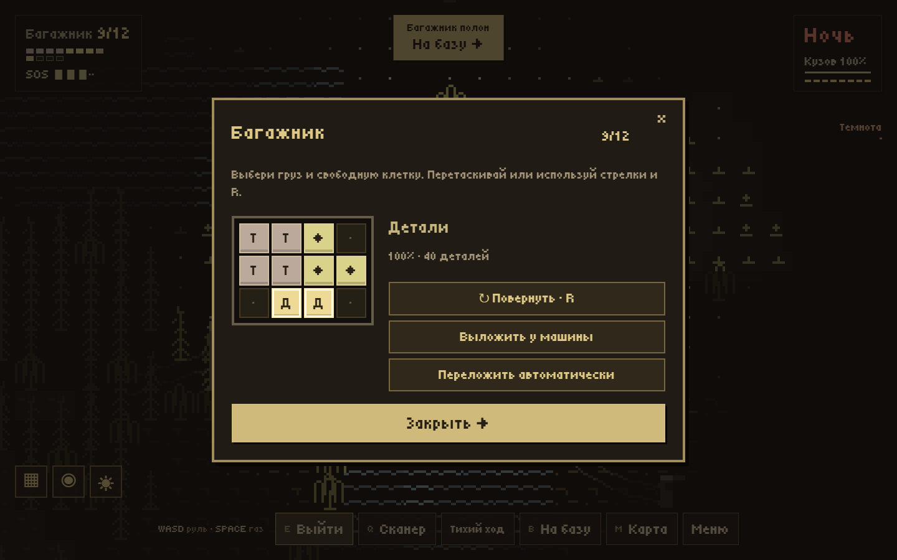
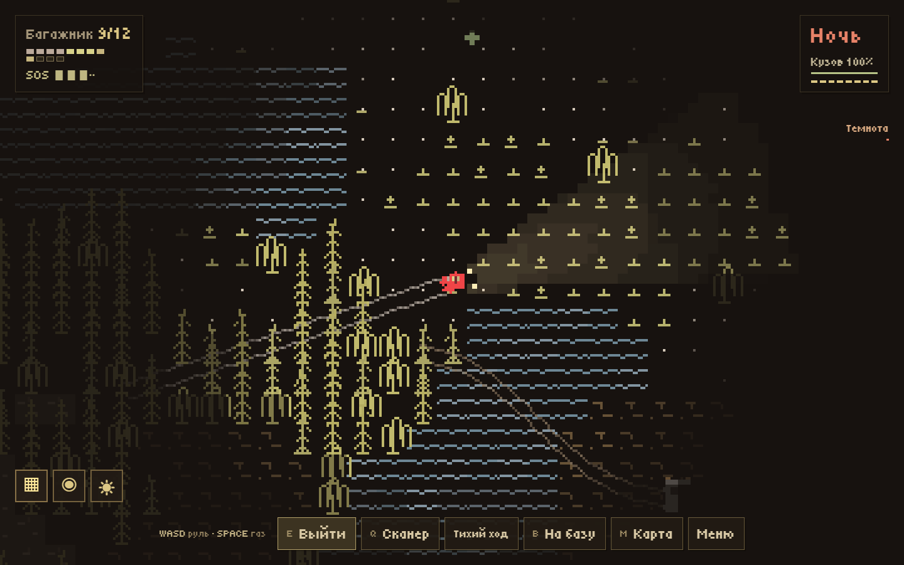
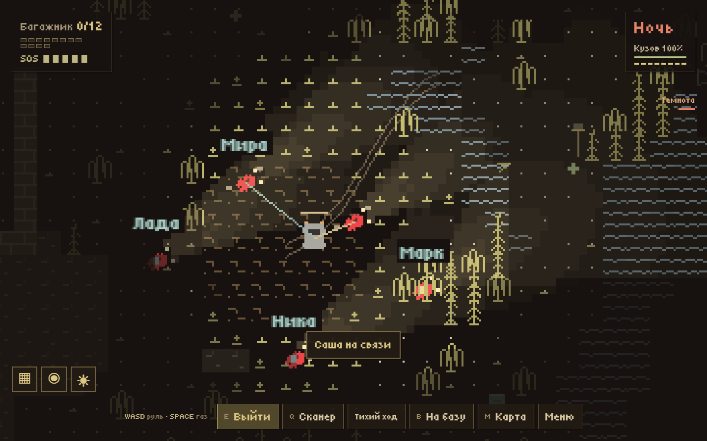

# GLUSH

<p align="center">
  
</p>

**A little red car. A world lost in the fog. Someone still on the radio.**

The transmitters have gone quiet. Roads disappear after sunset. Your station has enough light for one more departure. Follow a signal, carry something worth saving, and decide whether that last voice in the static is worth the detour.

### [▶ PLAY FREE IN YOUR BROWSER](https://glush.varantsov.ru/)

Single player or online co-op for **up to 5 players** · Desktop and touch controls · Russian in-game text

## About the Game

GLUSH is a procedural pixel exploration game about the journey home. Leave your car to search narrow ruins, fit awkward finds into your trunk, and haul stranded vehicles all the way to a safe evacuation post. Spend your earnings on a machine that feels like yours.

Daylight lasts eight minutes. You can return earlier, or stay after dark: the clock changes the danger, not your freedom to explore. Restored lamps become permanent shelters. A recovered cache stays recovered. The next departure continues your world.

## Pack for the road

Your trunk starts as a **4 × 3 grid**. Engines take a square, relay hearts form an L, and small parts fill the gaps. Rotate, drag, or auto-pack your finds; carry one item at a time between the ground and your car. Weight changes handling, impacts damage optics, and unstable cells have a limited charge.



*Actual gameplay: rotate a find, make room, or leave it marked on the ground for another trip.*

## Follow the light

Two warm headlights cut through the fog and stop at walls. Turn them off, slow the engine, and listen when the radio starts to growl. The hunter gives warning; restored light offers shelter. Near the end of a journey, an optional **Last Signal** may offer one more risky find. Saying no never blocks the story.



*Actual gameplay: a night drive through the procedural outskirts.*

## Bring your friends home

Create a world, choose a callsign and share its invitation. Up to five drivers have their own cars, trunks and upgrades, with shared discoveries, radio stories and expedition rewards. Connect a second winch, pull a friend's car, pass cargo on the ground, or light their route.

The world stays available when its creator leaves. When everyone disconnects, it saves and freezes until someone returns. Solo saves remain separate.



*Actual gameplay with five connected clients in a staged test expedition, including a second winch.*

## Make the world yours

- **Seven biomes:** outskirts, marshes, a snowy pass, amber woodland, singing dunes, ashlands and a crystal valley.
- **Three radio voices, twelve chapters:** a dispatcher reconnecting the region, a mechanic searching for a caravan, and a stranger in the static. Earlier achievements count toward later chapters.
- **Forty upgrade levels** across eight branches, plus **eight interchangeable modules** on four mounts. Choose towing power, visibility, cargo protection or endurance.
- **Six expedition conditions:** night, dense fog, fragile cargo, heavy convoy, limited charge and radio silence. Conditions and bonuses are shown before departure.
- **Seven rare places** embedded in the generated geography, each with a short scene and a one-time find.
- **A lasting world:** restored lamps, discoveries, rescued vehicles, abandoned cargo and unfinished tows persist. Fresh tire tracks fade; repeated journeys gradually wear a better-gripping road.
- **A reason to return:** new radio deliveries keep an explored district useful without respawning its original loot. Twenty-two legacy achievements and their rewards remain in the journal.

## Run locally

Use **Node.js 22.13 or newer**.

```bash
npm ci
npm run dev
```

Open the address printed by Vite, normally `http://127.0.0.1:5173`.

```bash
npm test                 # Simulation, migration, campaign and five-client tests
npm run build           # Production client in dist/
npm run server:build    # Portable server in server-dist/
npm run cloudflare:check # Cloudflare build without publishing
npm run standalone      # Single-file solo edition in ../Глушь.html
```

## Controls

| Action | Keyboard / mouse |
| --- | --- |
| Drive or walk | WASD / arrows; click the ground to steer toward it |
| Accelerate / dash on foot | Space |
| Brake / careful driving | Shift / Quiet driving button |
| Exit, pick up, load, enter, attach rope, restore lamp | E |
| Active scanner | Q |
| Headlights | L |
| Direction home / map | B / M |
| Trunk / radio | On-screen buttons |
| Move / rotate selected cargo | Drag or arrows / R; buttons also available |
| Pause / crew / settings | Esc / Menu |

On phones, use the left joystick and the right action buttons. Trunk, radio, lights, map, station, settings and crew commands are available by touch. Menus pause solo play; **the shared world continues while a co-op menu is open**.

## Saves and multiplayer

Solo progress saves in this browser, with v3/v4 → v5 migration and a backup. Currency, purchases and known world state carry over. Lamp activations never recorded by an older version cannot be reconstructed.

For co-op, choose **Играть с друзьями → Создать общий мир**, then copy the invitation. To return later, use **Продолжить общий мир** or the original link. Export your private player key from the crew menu before moving to another browser or device. Keep that key private; give friends the invitation instead. The crew menu also exports the shared world.

The public client runs on Vercel, with persistent rooms in Cloudflare Durable Objects using SQLite. The service uses platform free-tier limits; it does not automatically upgrade to a paid plan. New-world creation is limited to 5 per IP per day and 25 per day across the service. Existing worlds can still be resumed, subject to platform limits.

For your own **Node.js + WebSocket + SQLite** server, Docker setup, Cloudflare deployment, and world migration, see [Self-hosting](docs/self-hosting.md).

## Technology & Credits

TypeScript strict mode, Canvas 2D, Web Audio and Vite. Game simulation is independent of the browser renderer; both server adapters use the same rules. Sprites, lighting, weather and effects are drawn in code. Source code: [MIT](LICENSE).

Music: [“Machina” by Scott Buckley](https://www.scottbuckley.com.au/library/machina/), released under [CC BY 4.0](https://creativecommons.org/licenses/by/4.0/), transcoded for delivery and filtered during play. See [audio credits](public/audio/CREDITS.txt). Tiny5: [SIL Open Font License](public/fonts/TINY5-LICENSE.txt).

The original cover keeps its baked-in 24 px rounded corners. The screenshots above are captures of the game, not concept art.
