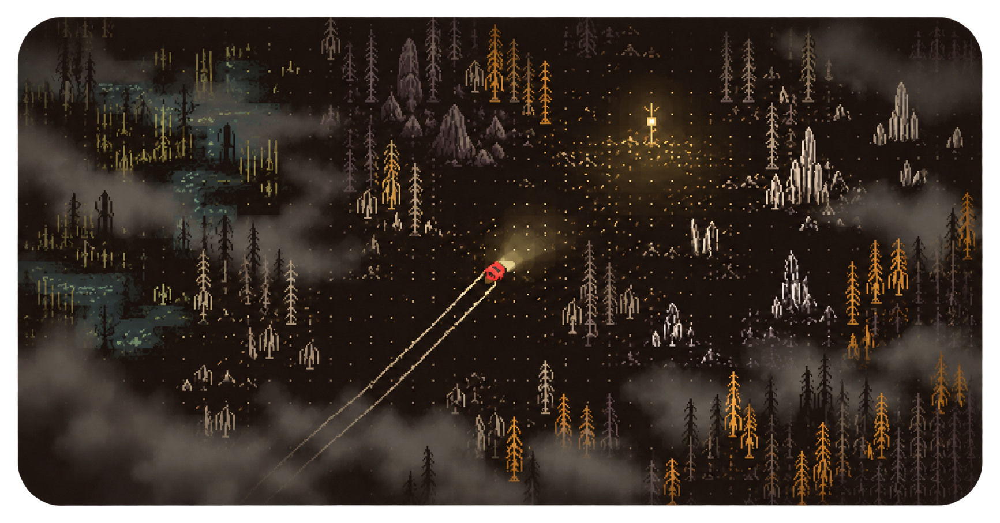

# ГЛУШЬ

<p align="center">
  
</p>

Последние ретрансляторы погасли, а дороги растворились в тумане. У тебя есть маленький красный вездеход, сканер и несколько минут света. Ищи сигналы, выходи из машины за грузом и решай, когда рискнуть ещё одной находкой, а когда повернуть к станции.

**[Играть в браузере →](https://glush-game.vercel.app)**

«ГЛУШЬ» — атмосферная процедурная пиксельная экспедиция: 7 биомов, 22 задания, 40 улучшений, спасения, патрули, ночь, буря и мир, который помнит твои поездки. Работает на компьютере и телефоне.

## Запуск

```bash
npm install
npm run dev
```

Открой `http://127.0.0.1:5173`. Для production-сборки: `npm run build`. Автономный HTML со встроенной музыкой: `npm run standalone`.

## Управление

`WASD` / стрелки — движение · `Space` — газ или рывок · `Shift` — тормоз · `E` — действие · `Q` — сканер · `B` — курс на базу · `M` — карта · `Esc` — пауза.

На телефоне доступны джойстик, газ, сканер, действие, тихий ход, карта и меню.

## Технологии и лицензии

TypeScript, Canvas 2D, Web Audio и Vite. Графика и процедурные эффекты создаются кодом. Исходный код — [MIT](LICENSE).

Музыка: [“Machina” — Scott Buckley](https://www.scottbuckley.com.au/library/machina/), [CC BY 4.0](https://creativecommons.org/licenses/by/4.0/). Tiny5 — SIL Open Font License. Подробности в [CREDITS.txt](public/audio/CREDITS.txt) и [лицензии шрифта](public/fonts/TINY5-LICENSE.txt).
